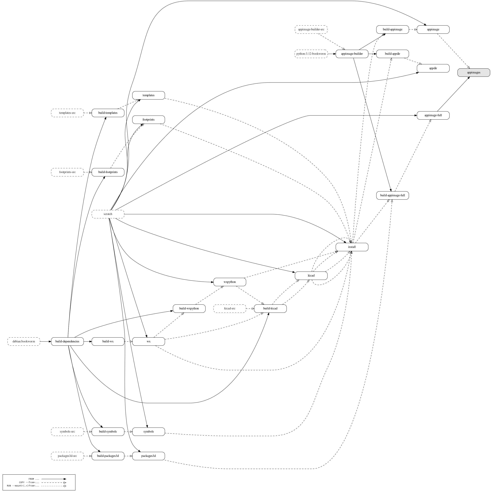

# Kicad Appimage

This repository contains continuous integration files for creating KiCad AppImages from source.

AppImage root filesystem is currently based on Debian Bookworm.

[appimage-builder](https://appimage-builder.readthedocs.io) (currently a fork with some additional changes) is used for building the AppImage with compatibility options in mind: it should work on distributions with standard C and C++ libraries even older than Debian Bookworm using compat runtime. The only dependency the host must always provide is an OpenGL driver matching KiCad version's hardware requirements. Drivers are not bundled for users to benefit from their system version and enable proprietary libGL to be used.

Image created using [patrickhoefler/dockerfilegraph](https://github.com/patrickhoefler/dockerfilegraph)
